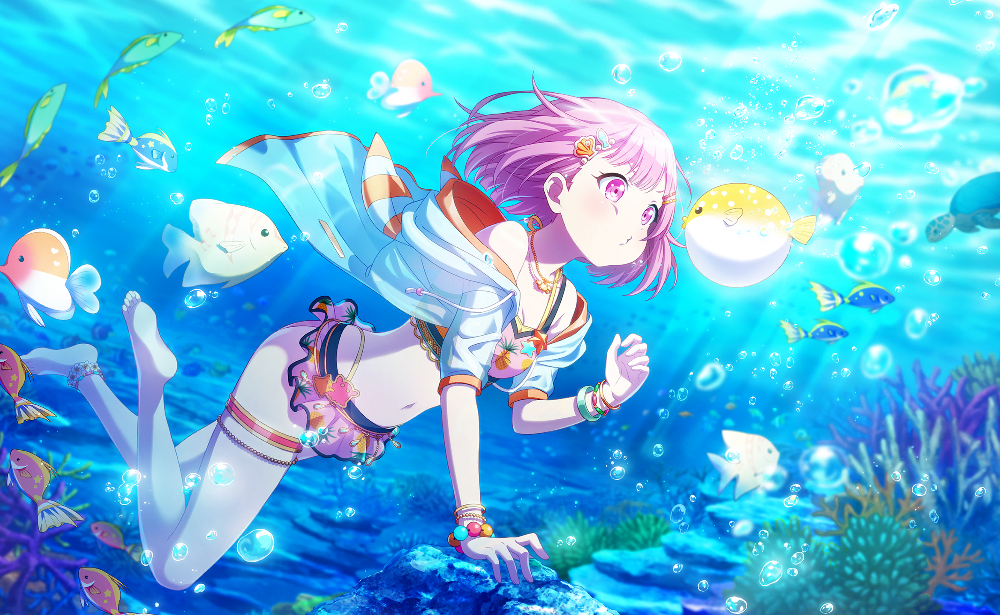

## 文本内容

一般用到的是H2和H3，H2用作段落的标题，H3用作段落内的小标题。

特殊字体：

**粗体**：双*号

*斜体*：单*号

## 引用

> 尝试创建一个引用...
>
> 引用中可以包含其它元素！但这个模版好像不支持引用套引用...
>
> - 分点
>
> 以及文本中的**粗体**和*斜体*

## 居中引用


这是引用内容，会自动居中并加上 `<p>` 标签。


## 列表

### 有序列表

1. 这是第一条内容
2. 这是第二条内容
3. ...

1.这是？这是普通的文本内容。

与普通文本的区别就是多了一点缩进。

### 无序列表

- 这是1
  - 这是1.1

按<kbd>Tab</kbd>即可嵌套。

### 列表中的元素嵌套

要在保留列表连续性的同时在列表中添加另一种元素，请将该元素缩进四个空格或一个制表符，如下例所示：

- 这是1

  这是一个段落

- 这是2

  > 这是一个引用

- 这是3

  1. 这是3.1
  2. ...

## 代码块

```json
{
  "firstName": "Miyazaki"
  "lastName": "Miya"
}
```

~~好丑的代码块！该修了...~~

长代码块测试

```html
<!--返回顶部按钮 -->
<a href="#" id="back-to-top" title="返回顶部"></a>

<!--返回顶部CSS -->
<style>
  #back-to-top {
    display: none;
    position: fixed;
    bottom: 20px;
    right: 55px;
    width: 55px;
    height: 55px;
    border-radius: 7px;
    background-color: rgba(64, 158, 255, 0.5);
    box-shadow: var(--shadow-l2);
    font-size: 30px;
    text-align: center;
    line-height: 50px;
    cursor: pointer;
  }

  #back-to-top:before {
    content: ' ';
    display: inline-block;
    position: relative;
    top: 0;
    transform: rotate(135deg);
    height: 10px;
    width: 10px;
    border-width: 0 0 2px 2px;
    border-color: var(--back-to-top-color);
    border-style: solid;
  }

  #back-to-top:hover:before {
    border-color: #2674e0;
  }

  /* 在屏幕宽度小于 768 像素时，钮位置调整 */
  @media screen and (max-width: 768px) {
    #back-to-top {
      bottom: 20px;
      right: 20px;
      width: 40px;
      height: 40px;
      font-size: 10px;
    }
  }

  /* 在屏幕宽度大于等于 1024 像素时，按钮位置调整 */
  @media screen and (min-width: 1024px) {
    #back-to-top {
      bottom: 20px;
      right: 40px;
    }
  }

  /* 在屏幕宽度大于等于 1280 像素时，按钮位置调整 */
  @media screen and (min-width: 1280px) {
    #back-to-top {
      bottom: 20px;
      right: 55px;
    }
  }

  /* 目录显示时，隐藏按钮 */
  @media screen and (min-width: 1536px) {
    #back-to-top {
      visibility: hidden;
    }
  }
</style>

<!--返回顶部JS -->
<script>
  function backToTop() {
    document.documentElement.scrollIntoView({
      behavior: 'smooth',
    })
  }

  window.onload = function () {
    let scrollTop =
      this.document.documentElement.scrollTop || this.document.body.scrollTop
    let totopBtn = this.document.getElementById('back-to-top')
    if (scrollTop > 0) {
      totopBtn.style.display = 'inline'
    } else {
      totopBtn.style.display = 'none'
    }
  }

  window.onscroll = function () {
    let scrollTop =
      this.document.documentElement.scrollTop || this.document.body.scrollTop
    let totopBtn = this.document.getElementById('back-to-top')
    if (scrollTop < 200) {
      totopBtn.style.display = 'none'
    } else {
      totopBtn.style.display = 'inline'
      totopBtn.addEventListener('click', backToTop, false)
    }
  }
</script>

```


## 分隔线

`***`or`---`

***

## 链接

```markdown
这是一个链接[My Homepage](hugoblog-gamma.vercel.app)
```

效果：这是一个链接[My Homepage](hugoblog-gamma.vercel.app)

不加标题：打<>号

eg. <https://hugoblog-gamma.vercel.app>

## 图片

### 单张图片


```markdown

```

### 画廊

* 仅支持本地图片



## 图片轮播



``````html
< imgloop "florian-klauer-nptLmg6jqDo-unsplash.jpg,helena-hertz-wWZzXlDpMog-unsplash.jpg" >
//使用时外侧加双引号
``````


## 自制评分卡片

{{< neodb url="https://bgm.tv/subject/137722" image="https://img2.doubanio.com/view/photo/m/public/p2326879831.webp" title="只有我不存在的城市" rate="7" brief="身为漫画家的主角藤沼悟因为现实生活不顺遂而持续挣扎，拥有着“再上映”的穿越时空能力，是可主动或被动地将时间反复倒带重演，借此阻止“事件”的发生。而他某天下班回到家时，从家乡来访的母亲因在超级市场意外目睹到 18 年前绑架犯的真实身份，认为与过去的雏月佳代的遇害事件有关。尔后母亲在悟的公寓遭到杀害，同时悟还被嫁祸成弑亲凶手；这时“再上映”能力启动，自己却回到 18 年前。来到 18 年前 2 月 15 日的悟决心要阻止整起事件的发生。彼时，在杀人案件中死去的同班同学雏月加代和山田广美尚未被害。悟决心利用自己的能力保护加代和广美的安全，洗清白鸟润身上的冤屈，并且找到真正的幕后黑手。在悟的努力下，个性阴沉孤僻的加代终于向他敞开了心胸，两人结下了深厚的友谊。随着案发日的一天天临近，茫茫的黑夜过去，当光明来临时，悟能否再度看见加代天真的笑脸呢？" tag="Anime" >}}

## 外链

1.网易云音乐卡片（会员歌曲无法播放，已弃用😡）

- 在手机端无法显示，原因未知



- Aplayer实现：
  

2.哔哩哔哩视频



3.Youtube视频



## 杂项



你好！

（（探头））



- 下标：`<sub></sub>`

  H<sub>2</sub>O

- 上标：`<sup></sup>`

  X<sup>n</sup> + Y<sup>n</sup> = Z<sup>n</sup>

- 键盘：`<kbd></kbd>`

  <kbd>CTRL</kbd> + <kbd>ALT</kbd> + <kbd>Delete</kbd>

- 强调：`<mark></mark>`

  Most <mark>salamanders</mark> are nocturnal, and hunt for insects, worms, and other small creatures.
  
- 删除线：`~~text~~`

  ~~世界是平坦的~~ 我们现在知道世界是圆的。
  
- Todo：`- [ ] task`

  - [x] 调整重点色
  - [x] 调整引用样式
  - [x] 调整代码块样式
  - [x] Typlog图片格式
  - [x] 调整<mark>标记</mark>颜色
  
- 文本黑幕：

  <span class="shady">看到这里的你！😡🫵<br>今天也会是美好的一天～☺️👐</span>

- 时间轴




相册语法来自 [Typlog](https://typlog.com/)