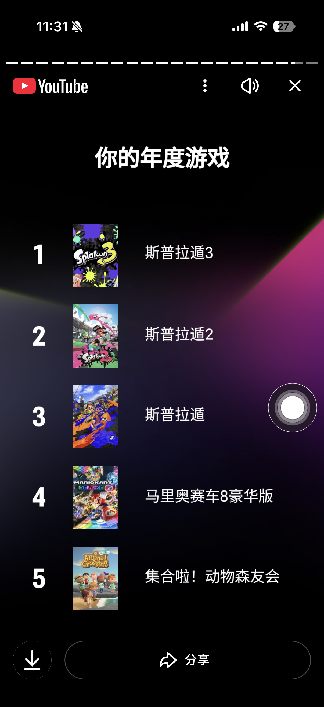
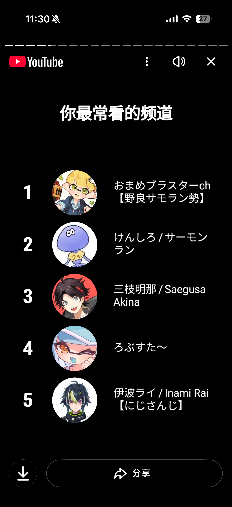
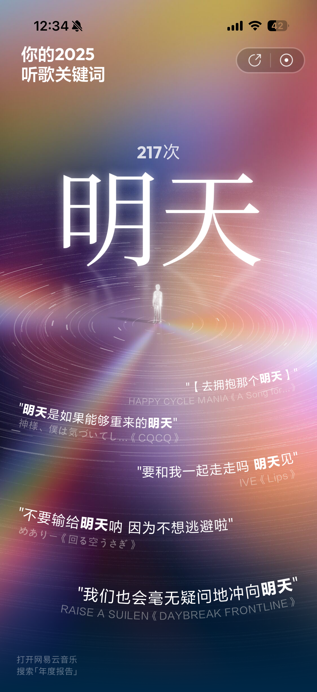
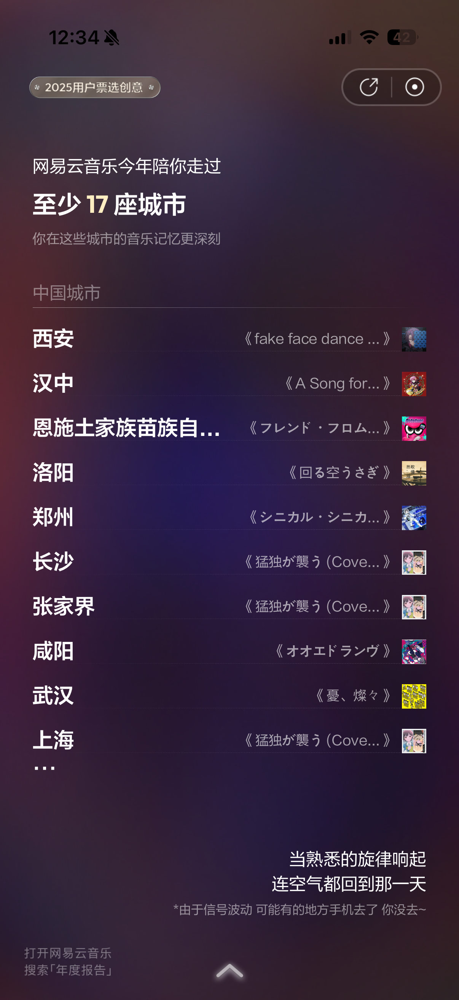
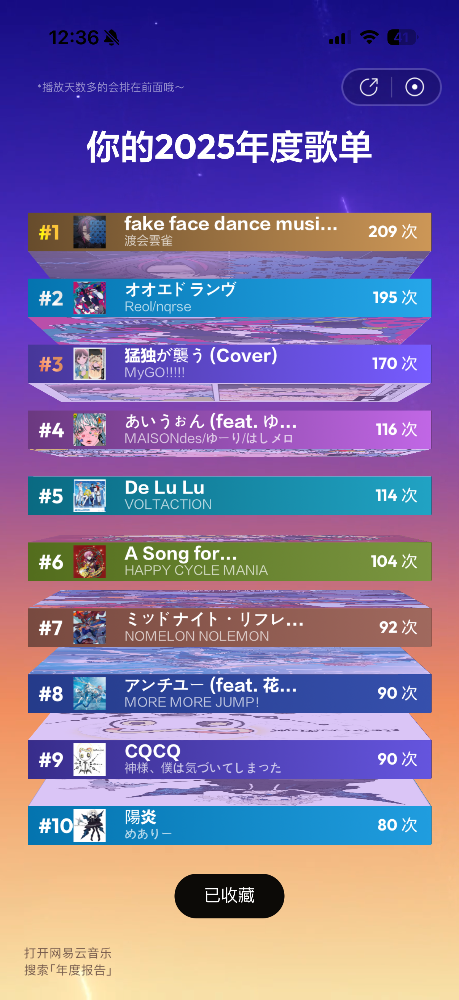

波乱万丈的2025，身边的一切变化了太多，割裂太大导致我在准备写年度总结的时候恍惚了一下，我的上半年都在干什么来着？……想不起来倒也是正常的，因为准备完复试弄完毕设后就开始不停的旅游，印象里只有自己累得半死瘫倒在宿舍的样子了。这种时候就会开始感谢各大软件的年度报告，要不是看到了上半年听的歌我可能真的什么都想不起来了。那么接下来就交给使用最多的软件们的年度报告吧！

## Youtube

依旧被管和喷统治的一年……上半年在冲康所以几乎是一整天都在挂着豆主包边听边打。虽然这样对我的技术没有任何帮助，但是听豆主包碎碎念唠武器编成小技巧还是能进一点脑子的，大概。虽然进的更多的应该是火焰纹章和卡比各系列的简介。豆主包你就这样爱！

然后就是彩虹社每年定番的马车。今年三枝明那终于夺冠！好燃！这个人真的很会出节目效果，从map pick到最后决赛的豪运，一路追下来看到第一确定的那一刻真的要掉眼泪了，完美的热血漫主角akina；；

## 今年的喷

考研结束之后厚积薄发的一年，一口气康了4张图，加上很久之前在金工蹭的卷堡，一共是5张〜接下来就剩鲑坝和破船两个硬茬了，希望在2026结束时能完成全图康的夙愿然后我就可以安心退坑了。

打了这么久了，这游戏真的是让人又爱又恨。网络环境、匹配机制、武器平衡……有太多让人一言难尽的点了，这些也确实是会一点点消磨人对于这个游戏的热情。但我知道我第一次打开喷2dlc，听到小八装置里传来的饭田制作的乐曲demo的那一刻就已经被这个游戏套牢了，这辈子也跑不掉了。相比之下3代dlc就有些缺乏诚意，虽然也很好玩，但是没有2代那样纯粹的讲好一个故事的感动。能说吗我觉得3代dlc的剧情内容约等于0而且讲述方式也不怎么样，2代的神演出&神曲给人的印象太深刻了。

不管怎样我还是爱这个游戏的，爱在游戏里遇到的朋友们，爱任天堂乌研所创造出的这个鲜明的世界。期待4代吧！



## 网易云音乐

周围人的wyy听歌关键词基本都是什么未来啊希望啊，看来这只能说明日本人写歌词的时候就是爱写这种词。不管怎么说，看到这个词和对应的曲子出来时还是有点被触动到。今年对我来说确实是充满了变动和不安的一年，曾经那样害怕、祈求不要到来的明天真正来临时，好像也没有那么可怕了。

正好在跑的最多的一年新增了城市足迹这个新统计。原来我是在今年年初才推完的kirakira，这游戏后劲太大又不停call back总给我一种已经推完一个世纪了的感觉。推完kirari end1的那天晚上窝在被子里一边听a song for一边掉眼泪，濑户口的文字总是很神奇，所有痛苦的事情在他笔下是写开了，留在我心里的难以言喻的纠结悲伤遗憾幸福全部扭成一团后就只能变成眼泪掉下来了。a song for是我在kirakira里唯一重复听的一首歌，可能喜欢痛苦大于喜欢快乐的扭曲人类是这样的。

还有一首想说的是喷2dlc的《フレンド・フロム・ファラウェイ》，和朋友们出门旅游的摇摇晃晃的大巴车上听的曲子。这首歌真的是一首完美的ed曲，登上地面时看到的第一束地上的阳光、祭典结束后一如既往的白天的天空，我的表达能力还不足以让我将这种微妙的温暖与悲伤交织的复杂感受具象化，但这大概与向过去告别、翻开新篇章时的感受是一致的吧。

***

我可能确实不擅长写这种总结一类的东西。小学的时候老师就教过，写日记不能写流水账，必须找一件事重点来写。如果让我选一件事来概括我的2025，那大概就是在新学期来校报道的时候，我把身份证丢在了出租车上。明明一只脚已经踏进了崭新的世界，却总有那样一个幼稚的自己，在飞速驶过的列车旁不安地四处张望。幸好，身边有我爱的人们和爱我的人们在，终究是以一个小孩子的模样，安全健康（？）地活到了现在。2025，依旧没能和自己好好相处，也没能和重要的人们好好相处，但比过去的自己似乎好了很多。2026，希望我能找到一个正常且舒适的生活节奏，最好能多动动，多接触点现实中的人类。

最后，感谢读到这里的你，也感谢拼命尝试留下些什么的我。新年快乐！
